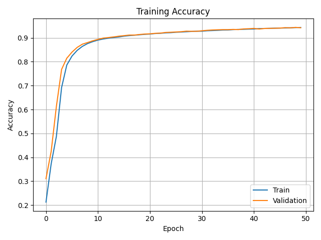
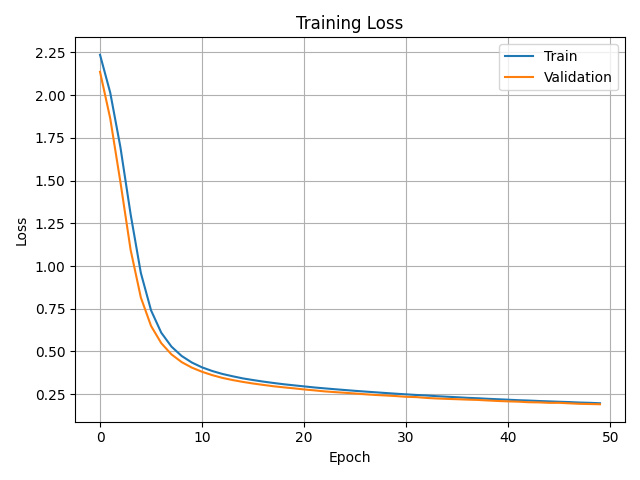
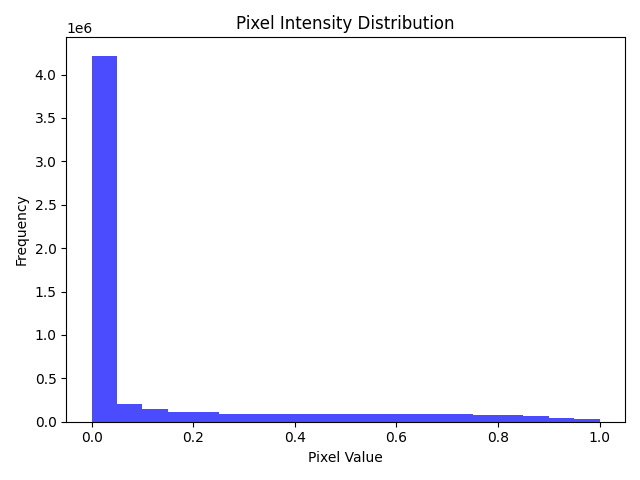
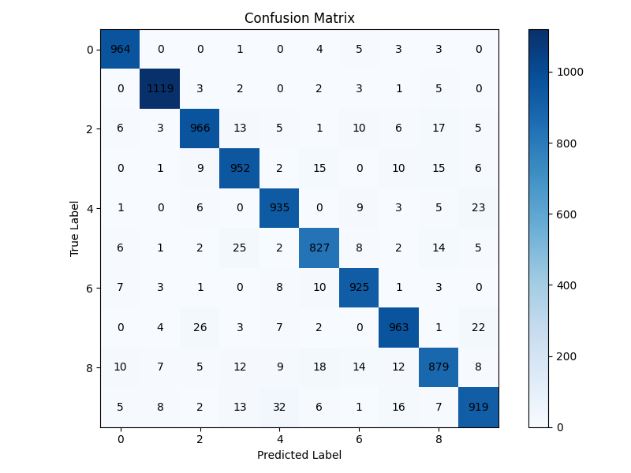
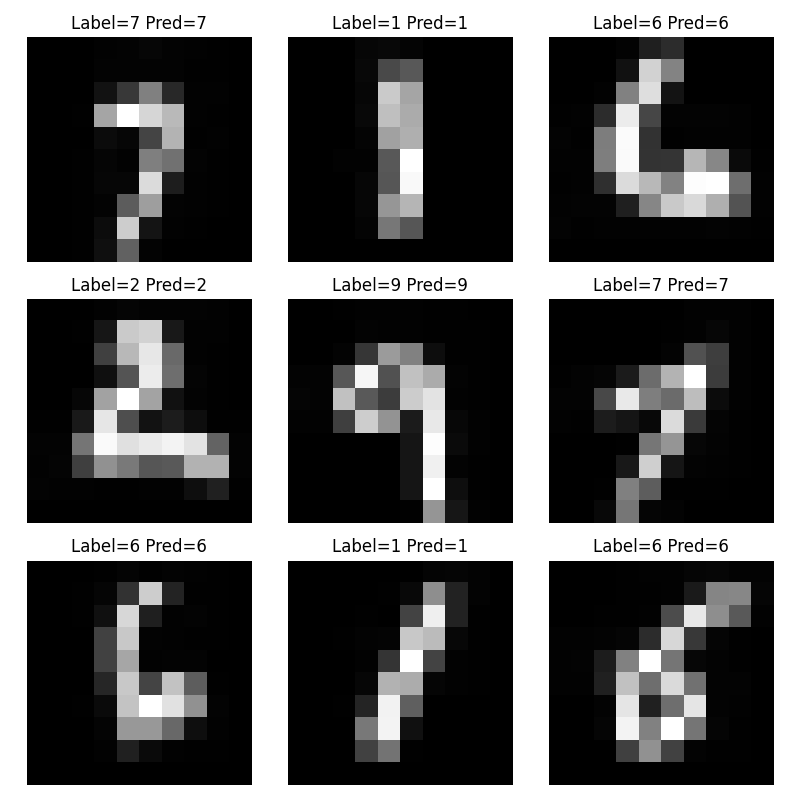

# **FPGA Neural Network Accelerator – Pynq-Z1**

Hardware-accelerated handwritten digit recognition using a custom neural-network engine built with **Vitis HLS**, integrated into **Vivado**, and controlled by an **ARM-side Vitis application**. A Python script streams MNIST test images over UART, and predictions are displayed using LEDs.

---

## **🧠 Neural Network Architecture**

| Layer   | Type            | Size        | Notes                       |
| ------- | --------------- | ----------- | --------------------------- |
| Input   | Flatten         | 10×10 → 100 | Normalized grayscale pixels |
| Dense 1 | Fully Connected | 100 → 32    | ReLU, no bias               |
| Dense 2 | Fully Connected | 32 → 16     | ReLU, no bias               |
| Output  | Fully Connected | 16 → 10     | Softmax                     |

**Model Accuracy: ~94.5%**


---

# 📊 Model Training Results

### **Training Accuracy**


### **Training Loss**


### **Pixel Distribution**


### **Confusion Matrix**


### **Example Predictions**


---

# ⚙️ High-Level Synthesis (HLS)

### What HLS Does  
- Converts **C/C++ → Synthesizable RTL (Verilog/VHDL)**  
- Automatically pipelines loops and adds parallelism  
- Generates an **AXI4-Lite interface** for the accelerator  

### What the HLS Accelerator Implements  
- MAC operations for Dense layers  
- ReLU activation as simple compare–select logic  
- Softmax output (max-index selection in software)  
- Weights stored inside BRAM arrays  

### Output of HLS  
- Synthesized RTL (Verilog + VHDL)  
- Packaged Vivado IP (`nn_inference`)  
- AXI-Lite control interface + BRAM ports  

---

# 🧩 Vivado Integration  
- Imported HLS IP into IP catalog  
- Enabled Zynq PS AXI-GP master port  
- Connected NN IP to AXI-Lite bus  
- Connected BRAM for weight + input storage  
- Generated HDL wrapper + bitstream  
- Exported hardware platform (.xsa)

---

# 🖥️ Vitis Application (Running on ARM)  

### The PS Application Does:  
1. Receives **100 pixel floats** via UART  
2. Writes pixels to BRAM  
3. Sets `ap_start` on NN accelerator  
4. Polls `ap_done`  
5. Reads output vector (10 values)  
6. Finds predicted digit  
7. Displays prediction on **PYNQ-Z1 LEDs**

---

# 🧪 Testing via Python (UART)  
Send any MNIST test image to the board:


py -3 uart_test_nn.py -port COM6

---

## **🧪 Summary of Model Performance**

| Metric                           | Value                    |
| -------------------------------- | ------------------------ |
| Test Accuracy                    | **94.53%**               |
| Loss                             | **0.1865**               |
| Inference Time (CPU, 10k images) | ~0.30 sec                |
| Inference Time (FPGA)            | Real-time (UART limited) |

---

# **📦 Repository Structure**

```
AI_ON_PYNQ/
│
├── EMBD_FPGA/                     <--- Vivado Project Files
│
├── FPGAI/                         <--- Vitis Project Files
│
├── FPGA_AI/                       <-- MAIN PROJECT DIRECTORY
│   │
│   ├── layer_1_weights.txt
│   ├── layer_2_weights.txt
│   ├── layer_3_weights.txt
│   ├── nn_inference_10x10.xsa     <-- exported hardware platform
│   │
│   └── src/
│       ├── hls/                   <-- HLS C++ accelerator files
│       ├── vhdl/                  <-- generated RTL
│       ├── vitis/                 <-- Vitis workspace + code
│       └── python/                <-- ML training + test scripts
│          
│
├── MNIST_Dataset_JPG/
│
├── MNIST_Dataset_JPG.zip
│
├── vitis_hls.log
│
└── README.md                    

```

---


